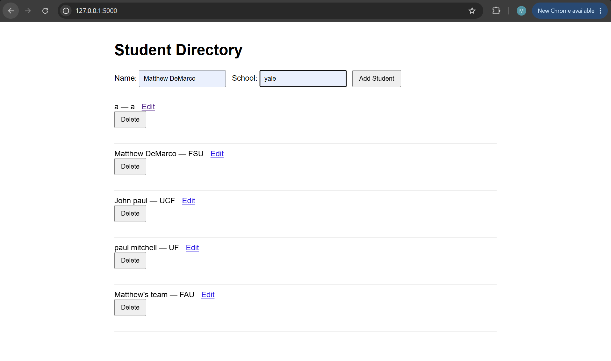
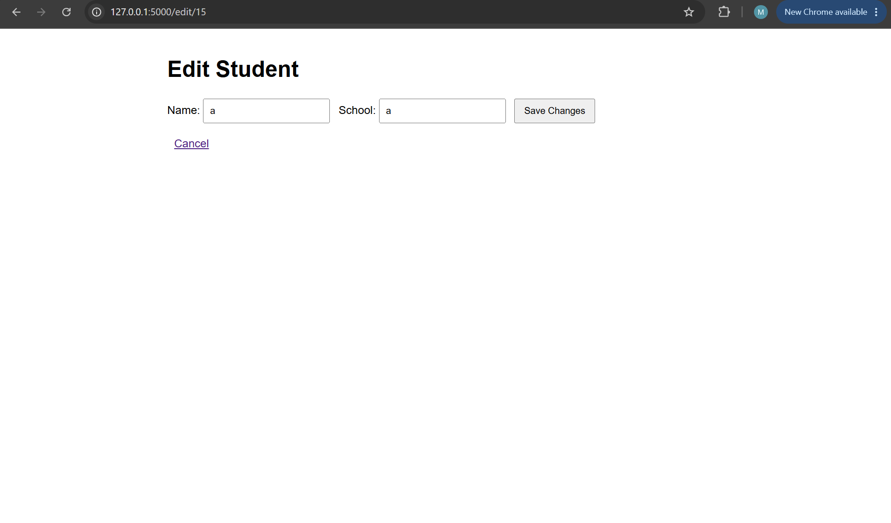
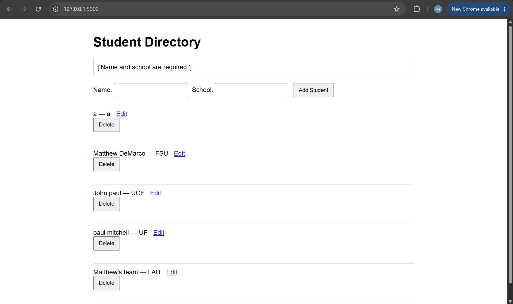
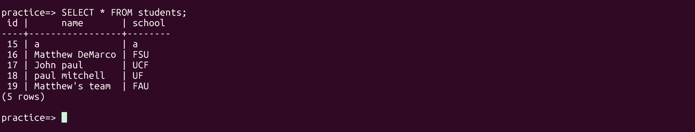
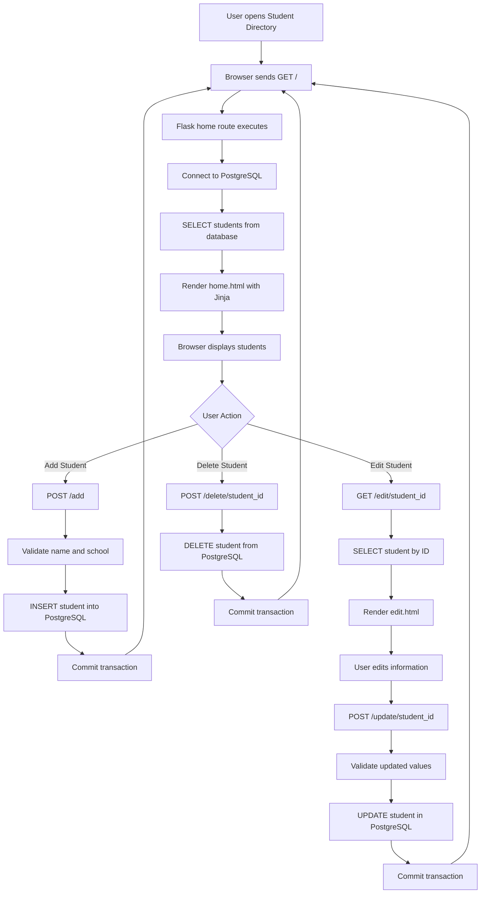

# Student Directory

A full-stack web application built with Flask and PostgreSQL that allows users to add, view, edit, and delete student records.

## Screenshots

### Student Directory

### Edit Student

### Validation

### PostgreSQL Database

## Application Architecture

## Features

- Add new students
- View all students stored in PostgreSQL
- Edit existing student information
- Delete students
- Server-side input validation
- Flash messages for invalid input
- 404 handling for students that do not exist
- PostgreSQL database persistence
- Environment variables for database credentials and application secrets
- Basic responsive styling

## Tech Stack

- Python
- Flask
- PostgreSQL
- psycopg
- HTML
- CSS
- Jinja
- python-dotenv
- Git

## CRUD Operations

The application supports all four CRUD operations:

| Operation | Description |
| --- | --- |
| Create | Add a new student |
| Read | View students stored in PostgreSQL |
| Update | Edit an existing student's information |
| Delete | Remove a student |

## Routes

### Home

    GET /

Retrieves all students from PostgreSQL and displays them on the Student Directory page.

### Add Student

    POST /add

Receives the student's name and school, validates the input, and inserts a new student into PostgreSQL.

### Edit Student

    GET /edit/<student_id>

Retrieves a specific student from PostgreSQL and displays their current information in an edit form.

### Update Student

    POST /update/<student_id>

Validates the submitted information and updates the selected student's record in PostgreSQL.

### Delete Student

    POST /delete/<student_id>

Deletes the selected student from PostgreSQL.

## Request Flow

When the user visits the application:

    Browser
        ↓
    GET /
        ↓
    Flask
        ↓
    PostgreSQL
        ↓
    SELECT students
        ↓
    Flask receives database results
        ↓
    Jinja renders HTML
        ↓
    Browser displays page

When a user adds, edits, or deletes a student, Flask modifies the PostgreSQL database, commits the transaction, and redirects the browser back to the home page.

## Project Structure

    student-directory/
    ├── app.py
    ├── README.md
    ├── requirements.txt
    ├── .gitignore
    ├── .env
    ├── static/
    │   └── style.css
    ├── screenshots/
    │   ├── home.png
    │   ├── edit.png
    │   ├── validation.png
    │   └── database.png
    └── templates/
        ├── home.html
        └── edit.html

The `.env` file contains private configuration values and is excluded from Git using `.gitignore`.

## Environment Variables

Create a `.env` file in the root of the project:

    DB_NAME=practice
    DB_USER=student_app
    DB_PASSWORD=your_database_password
    DB_HOST=localhost
    SECRET_KEY=your_secret_key

Do not commit the `.env` file to GitHub.

## Installation

### 1. Clone the Repository

    git clone <repository-url>
    cd student-directory

### 2. Create a Virtual Environment

    python3 -m venv venv

### 3. Activate the Virtual Environment

Linux/macOS:

    source venv/bin/activate

### 4. Install Dependencies

    pip install -r requirements.txt

### 5. Configure PostgreSQL

Create a PostgreSQL database.

Then create the `students` table:

    CREATE TABLE students (
        id SERIAL PRIMARY KEY,
        name TEXT NOT NULL,
        school TEXT NOT NULL
    );

Configure your PostgreSQL credentials inside the `.env` file.

### 6. Run the Application

    python3 app.py

Open the application in your browser:

    http://127.0.0.1:5000

## Validation

The application performs server-side validation before inserting or updating records.

Input values are cleaned using `.strip()`:

    name = request.form["name"].strip()
    school = request.form["school"].strip()

Blank or whitespace-only values are rejected.

When invalid input is submitted, Flask uses flash messages to display an error to the user without leaving the application.

## Error Handling

The application checks whether requested students exist before editing, updating, or deleting them.

If a student cannot be found, the application returns a `404 Not Found` response instead of continuing with an invalid database operation.

The application also checks the number of database rows affected by update and delete operations.

## Security

Database credentials and the Flask secret key are stored using environment variables instead of being hardcoded directly in the Python source code.

The `.env` file is ignored by Git so sensitive information is not uploaded to GitHub.

SQL queries use parameterized values rather than inserting user input directly into SQL strings.

## What I Learned

Building this project helped me understand:

- How Flask applications handle HTTP requests
- How GET and POST requests work
- How HTML forms send data to a backend
- How dynamic Flask routes use URL parameters
- How Flask communicates with PostgreSQL
- How SQL `SELECT`, `INSERT`, `UPDATE`, and `DELETE` operations work
- How PostgreSQL transactions use `commit()`
- How database IDs identify individual records
- How Jinja templates render dynamic database data
- How redirects work after POST requests
- How server-side validation protects the backend
- How Flask flash messages work across redirects
- How sessions and secret keys support Flask features
- How to handle missing database records
- How environment variables separate secrets from application code
- How Git can track the development of a full-stack application

## Future Improvements

- Add search and filtering
- Improve the user interface
- Add user authentication
- Add automated tests
- Create JSON REST API endpoints
- Dockerize the application
- Deploy the application online

## Author

Matthew DeMarco
Computer Science Student at Florida State University
