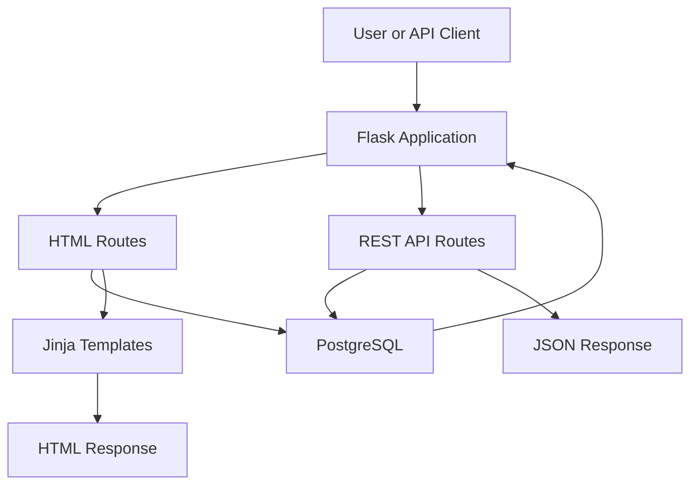

# Student Directory

A full-stack web application built with Flask and PostgreSQL that allows users to add, view, edit, and delete student records.

The project also includes a JSON REST API, automated pytest coverage, Docker Compose support, and a live Railway deployment connected to a hosted PostgreSQL database.

## Live Demo

The application is deployed on Railway with a hosted PostgreSQL database.

https://student-directory-production.up.railway.app/

## Screenshots

### Student Directory


### Edit Student


### Validation


### PostgreSQL Database


## Application Architecture



## Features

- Add new students
- View all students stored in PostgreSQL
- Edit existing student information
- Delete students
- Server-side input validation
- Flash messages for invalid input
- 404 handling for students that do not exist
- PostgreSQL database persistence
- Environment variables for configuration and secrets
- JSON REST API
- Automated testing with pytest
- API endpoint testing
- Dockerized Flask application
- PostgreSQL container managed with Docker Compose
- Persistent PostgreSQL data using a Docker volume
- Automatic database table initialization with SQL
- Production server with Gunicorn
- Live deployment on Railway
- Hosted PostgreSQL database
- Basic responsive styling

## Tech Stack

- Python
- Flask
- PostgreSQL
- psycopg
- pytest
- Docker
- Docker Compose
- Gunicorn
- Railway
- HTML
- CSS
- Jinja
- python-dotenv
- Git
- GitHub

## CRUD Operations

The application supports all four CRUD operations:

| Operation | HTTP Method | Description |
| --------- | ----------- | ----------- |
| Create | POST | Add a new student |
| Read | GET | View student data |
| Update | PUT / POST | Edit student information |
| Delete | DELETE / POST | Remove a student |

## Web Routes

### Home

```text
GET /
```

Retrieves all students from PostgreSQL and displays them on the Student Directory page.

### Add Student

```text
POST /add
```

Receives the student's name and school from an HTML form, validates the input, and inserts a new student into PostgreSQL.

### Edit Student

```text
GET /edit/<student_id>
```

Retrieves a specific student from PostgreSQL and displays their current information in an edit form.

### Update Student

```text
POST /update/<student_id>
```

Validates submitted form data and updates the selected student.

### Delete Student

```text
POST /delete/<student_id>
```

Deletes the selected student from PostgreSQL.

## REST API

The application also provides JSON REST API endpoints.

### Get All Students

```text
GET /api/students
```

Returns all students as JSON.

Example response:

```json
[
  {
    "id": 1,
    "name": "Alex Johnson",
    "school": "Florida State University"
  }
]
```

### Get One Student

```text
GET /api/students/<student_id>
```

Returns one student by ID.

If the student does not exist, the API returns:

```json
{
  "error": "Student not found"
}
```

with a `404 Not Found` status.

### Create Student

```text
POST /api/students
```

Accepts JSON data:

```json
{
  "name": "Alex Johnson",
  "school": "Florida State University"
}
```

A successful request returns the created student with a `201 Created` status.

### Update Student

```text
PUT /api/students/<student_id>
```

Accepts updated JSON data and modifies the selected student.

Example request:

```json
{
  "name": "Updated Student",
  "school": "Updated School"
}
```

### Delete Student

```text
DELETE /api/students/<student_id>
```

Deletes the selected student.

Example response:

```json
{
  "message": "Student deleted"
}
```

## Request Flow

### Web Page Request

```text
Browser
    ↓
Flask route
    ↓
PostgreSQL
    ↓
SQL result
    ↓
Jinja template
    ↓
HTML response
    ↓
Browser
```

### API Request

```text
Client
    ↓
API endpoint
    ↓
Flask
    ↓
PostgreSQL
    ↓
SQL result
    ↓
JSON response
    ↓
Client
```

## Docker Architecture

When running locally with Docker Compose:

```text
Browser / API Client
        ↓
Flask Container
        ↓
PostgreSQL Container
```

The Flask application runs in the `web` container.

PostgreSQL runs in the `db` container.

Docker Compose places both services on the same Docker network.

The Flask container connects to PostgreSQL using:

```text
DB_HOST=db
```

The browser reaches Flask through port `5000`.

## Deployment Architecture

The production application is deployed on Railway.

```text
User
 ↓
Public Railway URL
 ↓
Gunicorn
 ↓
Flask Application
 ↓
Railway PostgreSQL
```

Railway hosts the Flask application and PostgreSQL database remotely, allowing the application to be accessed over the internet.

Gunicorn is used as the production web server for the Flask application.

## Project Structure

```text
student-directory/
├── app.py
├── Dockerfile
├── compose.yaml
├── README.md
├── requirements.txt
├── test_app.py
├── .env
├── .gitignore
├── .dockerignore
├── db/
│   └── init.sql
├── static/
│   └── style.css
├── screenshots/
│   ├── home.png
│   ├── edit.png
│   ├── validation.png
│   └── database.png
└── templates/
    ├── home.html
    └── edit.html
```

The `.env` file contains private configuration values and is excluded from Git using `.gitignore`.

## Environment Variables

Create a `.env` file in the project root:

```text
DB_NAME=practice
DB_USER=student_app
DB_PASSWORD=your_database_password
DB_HOST=localhost
SECRET_KEY=your_secret_key
```

Do not commit the `.env` file to GitHub.

Docker Compose reads the database credentials from environment variables while using:

```text
DB_HOST=db
```

inside the Flask container.

In production, Railway environment variables are used to connect the Flask application to the hosted PostgreSQL database.

## Running with Docker

Build and start the Flask and PostgreSQL containers:

```bash
docker compose up --build
```

Or run them in the background:

```bash
docker compose up -d --build
```

Open:

```text
http://127.0.0.1:5000
```

Stop the containers:

```bash
docker compose down
```

To also delete the PostgreSQL Docker volume and reset the Docker database:

```bash
docker compose down -v
```

The PostgreSQL volume allows database data to persist when containers are stopped or recreated.

The `db/init.sql` file creates the `students` table when the Docker database is initialized for the first time.

## Running Without Docker

### 1. Clone the Repository

```bash
git clone <repository-url>
cd student-directory
```

### 2. Create a Virtual Environment

```bash
python3 -m venv venv
```

### 3. Activate the Virtual Environment

```bash
source venv/bin/activate
```

### 4. Install Dependencies

```bash
pip install -r requirements.txt
```

### 5. Configure PostgreSQL

Create a PostgreSQL database and the `students` table:

```sql
CREATE TABLE students (
    id SERIAL PRIMARY KEY,
    name TEXT NOT NULL,
    school TEXT NOT NULL
);
```

Configure the database credentials inside `.env`.

### 6. Run the Application

```bash
python3 app.py
```

Open:

```text
http://127.0.0.1:5000
```

## Testing

The project includes automated testing with pytest.

Run all tests:

```bash
pytest
```

The test suite covers both the HTML web routes and the REST API.

### Web Route Tests

Tests include:

- Home page response
- Missing student 404 handling
- Blank input validation
- Adding a student
- Updating a student
- Deleting a student

### API Tests

Tests include:

- Getting all students
- Getting one student
- Missing student 404 behavior
- Creating a student with JSON
- Updating a student with JSON
- Deleting a student
- Rejecting invalid JSON input

A separate PostgreSQL test database is used so automated tests do not modify the normal development database.

## Validation

The application performs server-side validation before inserting or updating student records.

Input values are cleaned using `.strip()`.

Example:

```python
name = data.get("name", "").strip()
school = data.get("school", "").strip()
```

Blank or whitespace-only values are rejected.

HTML routes use Flask flash messages for validation errors.

API routes return JSON error messages with appropriate HTTP status codes.

## Error Handling

The application checks whether requested students exist before editing, updating, deleting, or returning them through the API.

Missing students return a `404 Not Found` response.

The application also checks the number of database rows affected by update and delete operations.

## Security

Database credentials and the Flask secret key are stored using environment variables rather than being hardcoded directly in the Python source code.

The `.env` file is ignored by Git so private values are not uploaded to GitHub.

Docker Compose references environment variables instead of storing private values directly in `compose.yaml`.

Railway environment variables are used for production database credentials and application secrets.

SQL queries use parameterized values instead of directly inserting user input into SQL strings.

## What I Learned

Building this project helped me understand:

- How Flask handles HTTP requests
- How GET, POST, PUT, and DELETE requests work
- How HTML forms send data to a backend
- How REST APIs expose backend data as JSON
- How API endpoints are structured
- How Flask reads JSON request bodies
- How HTTP status codes communicate request results
- How Flask communicates with PostgreSQL
- How SQL `SELECT`, `INSERT`, `UPDATE`, and `DELETE` operations work
- How PostgreSQL transactions use `commit()`
- How database IDs identify individual records
- How Jinja templates render dynamic database data
- How redirects work after POST requests
- How server-side validation protects the backend
- How Flask flash messages work across redirects
- How missing database records are handled
- How environment variables separate secrets from application code
- How automated tests verify backend behavior
- How pytest tests HTML routes and API endpoints
- How pytest fixtures can clean up test data
- How Flask's test client sends simulated requests
- How Docker images and containers package an application
- How Docker Compose runs multiple services together
- How containers communicate over a Docker network
- How Docker volumes persist database data
- How SQL initialization scripts prepare a database automatically
- How Gunicorn runs Flask in a production environment
- How to deploy a Flask application to a cloud platform
- How a deployed application connects to a hosted PostgreSQL database
- How production environment variables configure database connections
- How to connect to and manage a remote PostgreSQL database
- How to debug backend, database, Docker, and deployment errors using logs
- How Git and GitHub track the development of a full-stack application

## Future Improvements

- Add user authentication
- Add search and filtering
- Improve the user interface
- Add pagination
- Add more advanced API validation
- Add database migrations

## Author

Matthew DeMarco  
Computer Science Student at Florida State University
